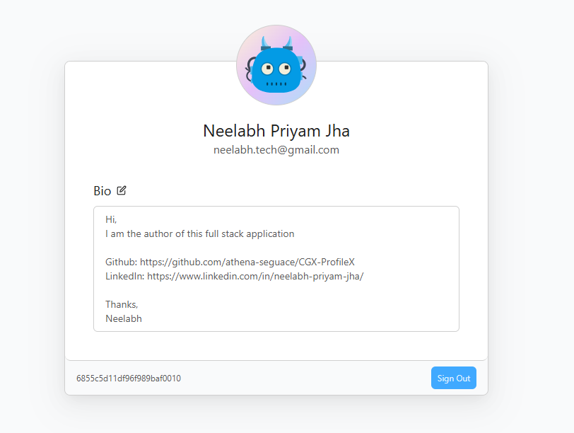

# CGX-ProfileX

A full-stack web application built with **React (Vite)**, **Node.js (Express)**, and **MongoDB Atlas**, developed for the **CGS (IIT KGP) 2025 Sophomore Selection Task** under the **WebX Track**.

Author: **Neelabh Priyam Jha**

## Project Overview

CGX-ProfileX is a full-stack profile dashboard app that allows users to create and manage personalized profiles.

### Tech Stack

-   **Client:** React (Vite)
-   **Server:** Node.js + Express
-   **Database:** MongoDB
-   **Auth:** JWT (HTTP-only cookies)
-   **Deployment:** Render.com
-   **Containerization:** Docker, Docker Compose
-   **Language:** TypeScript

## UI Preview

Here are a few screenshots from the live app:

### SingIn Page


### SingUp Page


### Profile Page



### Edit Bio Page


## Features

-   **User Authentication**

    -   Register and log in using secure, cookie-based JWT authentication.
    -   Auth state persists across page reloads via HTTP-only cookies.

-   **Profile Management**

    -   Users can view their profile after logging in.
    -   Profile data is fetched securely from the Server.

-   **Client (React + Vite)**

    -   Responsive single-page application (SPA).
    -   React Router for protected routes like `/profile`.

-   **Server (Express + MongoDB)**

    -   RESTful API with secure endpoints.
    -   MongoDB Atlas for cloud-hosted database operations.

## Project Structure

This project follows a standard full-stack monorepo layout:

```text
CGX-ProfileX/
├── client/             # React Client (Vite)
├── server/             # Express Server (Node.js)
├── ...
```

### Architecture

-   The React client is a SPA built with Vite and deployed as a static site.
-   The Express server exposes REST APIs and connects to MongoDB database for persistent data storage..
-   Authentication uses secure HTTP-only cookies.
-   Client and server are deployed separately and communicate over HTTPS.
-   CORS is handled on the backend and configured using the `.env` file inside the `server/` directory.

## Installation & Local Development

To run CGX-ProfileX locally without Docker, follow the steps below.

### 1. Prerequisites

-   Node.js (v18 or above)
-   npm (or yarn)
-   Local MongoDB server or MongoDB Atlas account (for a cloud-hosted DB URI)

---

### 2. Clone the Repository

```bash
git clone https://github.com/athena-seguace/CGX-ProfileX
cd CGX-ProfileX
```

### 3. Setup Server (can work standalone)

```bash
cd server
npm install
```

Create a `.env` file inside the `server/` directory similar to `server/.env.sample`:

```env
NODEJS_SERVER_ENV = "dev"

NODEJS_SERVER_MONGODB_URI = "REPLACE_WITH_CONNECTION_URL"
NODEJS_SERVER_MONGODB_POOL_SIZE = "50"

NODEJS_SERVER_CLIENT_URL = "http://localhost:5173"
NODEJS_SERVER_SERVER_PORT = "5500"

NODEJS_SERVER_JWT_SECRET_KEY = "REPLACE_WITH_YOUR_SECRET_KEY"
```

Start the server:

```bash
npm run compile
npm start
```

The server will run on [http://localhost:5500](http://localhost:5500).

### 4. Setup Client (client has dependency on the server)

```bash
cd client
npm install
```

Create a `.env.development` file inside the `client/` directory similar to `client/.env.development.sample`:

```env
VITE_SERVER_API_BASE_URL = http://localhost:5500/api/v1
```

Start the client:

```bash
npm run dev
```

The client can be accessed on [http://localhost:5173](http://localhost:5173).

## Deployment

Docker-based deployment has been removed. However, the app can still be deployed on platforms like Render.com, or you can deploy it locally. Docker-based containerization will be reintroduced soon.

## Acknowledgements

Special thanks to **CGS (IIT Kharagpur)** for organizing this event and providing the opportunity to learn and build.

## Final Note

To anyone taking the time to read through this project — thank you.

Whether you're a reviewer, a fellow developer, or someone just exploring, I genuinely appreciate your time and attention.

Warm regards,
Neelabh Priyam Jha

---
